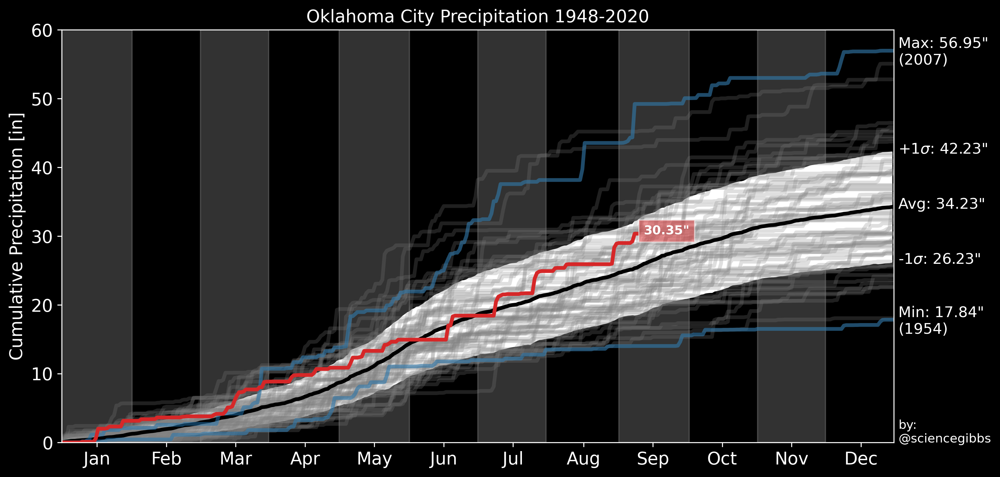

# Overview
This respository contains various example scripts to plot and analyze weather data

If you encounter a problem, [get in touch][3].

## Precipitation
[Example of plotting precipitation climatology and current year][1]

# License
This template is free source code. It comes without any warranty, to the extent permitted by applicable law. You can redistribute it and/or modify it under the terms of the Do What The Fuck You Want To Public License, Version 2, as published by Sam Hocevar. See [http://www.wtfpl.net][2] for more details.

[1]: precip_kokc.py
[2]: http://www.wtfpl.net
[3]: mailto:jeremy.gibbs@noaa.gov
